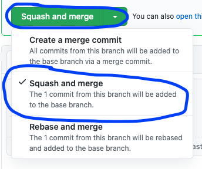

# NEO React Library PR best practices

This is the "living document" that describes the teams agreed upon bets practices. It is part of the repo so that, as this doc changes, it's changes are logged and agreed upon by the members of the team.

### the "must dos"

- 2 approvals before merging
- keep the repo clean by deleting your branch after merging
- if you've added tests, show the output of the tests (image)
- if you've added functionality, show it (eg, [with a GIF](https://gifox.io/)/recording)
- prepend title with ticket number, eg: `NEO-420 // do the thing`
- "squash and merge" your branch into `main` 

### the "good ideas"

- aim for <400 lines of code per PR (<200 is possible)
- check in early, request reviews early
